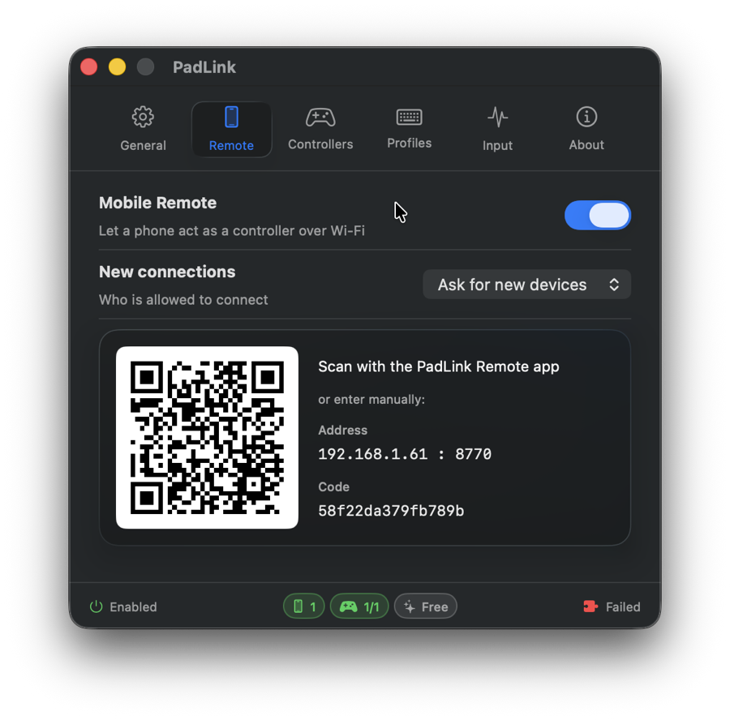
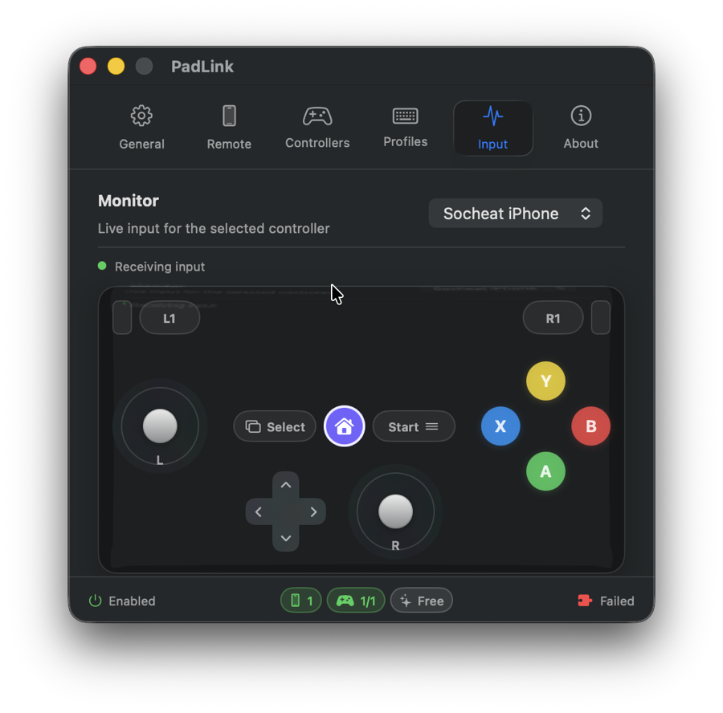
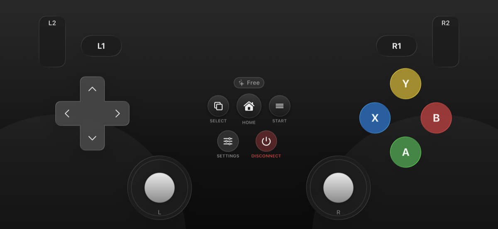
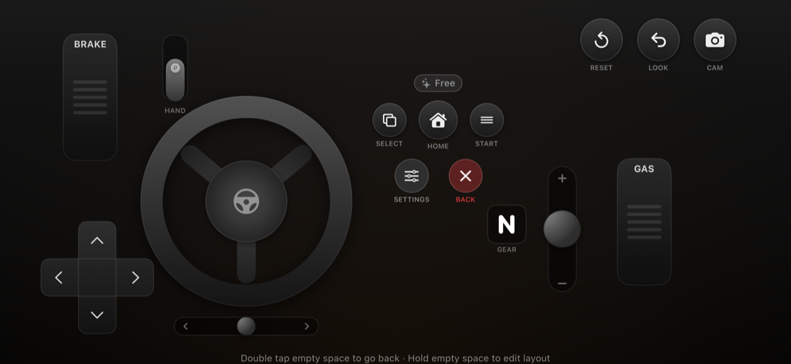

# PadLink

**Make game controllers that macOS doesn't natively recognize work like they should.**

Some USB/Bluetooth gamepads are perfectly valid HID devices, but their report descriptors
aren't on macOS's recognized list — so games ignore them. PadLink reads the controller
directly and re-presents it to macOS, the way Steam Input does, so your games finally see it.

> This is the **public community & downloads** hub for PadLink. Use it to **download the app**,
> **report bugs**, **request features**, and **request support for a new controller**. (The
> application source code is not hosted here.)

---

## ⬇️ Download

**[Download the latest version →](https://github.com/nimets-dev/PadLink-Community/releases/latest)**

- **macOS** — available now (Apple Silicon + Intel). Notarized by Apple.
- **Windows** — planned.

After downloading, open the installer and drag PadLink to your Applications folder.

---

## What it does

PadLink reads your physical controller once and routes its input through one of two output modes:

- **Keyboard & Mouse mode** — maps controller buttons/sticks to keystrokes and mouse movement.
  Works with any game or app. Needs only macOS Accessibility permission.
- **Gamepad mode** — presents a standard virtual controller to macOS so games see a real
  gamepad (with full stick/trigger support and on-screen glyphs).

A free tier covers the essentials; **PadLink Pro** unlocks multi-controller support and more.
See the in-app About / Plan screen for details.

---

## 📸 Screenshots

### macOS app

  
  &nbsp;
  

### PadLink Remote (iOS)

  
  &nbsp;
  

---

## 📱 PadLink Remote — use your phone as a controller

No physical gamepad? **PadLink Remote** (iOS) turns your phone into a wireless controller. It
shows an on-screen touch gamepad — two sticks, an 8-way D-pad, face buttons, shoulders, and
travel-based triggers, plus a touchpad mouse mode — and sends your input to the Mac over your
local network, where it drives the exact same output as a physical pad (gamepad **or**
keyboard/mouse mode).

- **Multiple layouts** — a standard **gamepad** layout, plus a **Car Driving** cockpit for racing
  games: a rotating steering wheel (or optional tilt/motion steering), gas and brake pedals, a
  sequential gear shifter, and a handbrake. Switch to the surface that fits what you're playing.
- **Pair in seconds** — scan a QR code or enter the Mac's IP; reconnect to known Macs with one tap.
- **Feels real** — haptic vibration (including live trigger rumble) and optional click sounds.
- **Make it yours** — drag, resize, and restyle the on-screen controls with the built-in layout editor.
- **Stays awake** — keeps the phone screen on while you play.

Get **PadLink Remote** from the App Store, open PadLink on your Mac, and pair. _(iOS available
now; Android planned.)_

---

## 🎮 Supported controllers

| Controller | USB VID:PID | Status |
|------------|-------------|--------|
| SHANWAN "Android Gamepad" | `0x2563:0x0526` | ✅ Supported |
| "PS3/PC Gamepad" clone | `0x2563:0x0575` | ✅ Supported |

**Don't see your controller?** PadLink can likely support it — open a
**[New Controller Support request](https://github.com/nimets-dev/PadLink-Community/issues/new?template=controller_support.yml)**
and include the details the form asks for (we use them to add a decode profile for your pad).

---

## 🗺️ Roadmap

### ✅ Available now
- 🖥️ macOS menu-bar app & dashboard
- ⌨️ Keyboard & Mouse mode
- 🎮 Up to 4 controllers at once, with reusable mapping profiles
- 📱 PadLink Remote (iOS) — Gamepad & Car Driving layouts
- 📳 Haptics & trigger rumble
- ✏️ Drag-to-edit layout editor & QR / IP pairing
- 💎 PadLink Pro

### 🔜 Coming soon
- 🕹️ Virtual Gamepad mode (pending Apple driver approval)
- 🔄 Automatic updates

### 🔭 Planned / future
- 💻 Windows app
- 🤖 PadLink Remote for Android
- ➕ More controllers
- ✈️ More Remote layouts & skins (incl. Airplane type)
- 🚀 Launch at login

> Timelines aren't promises. Want something prioritized?
> [Request a feature](https://github.com/nimets-dev/PadLink-Community/issues/new?template=feature_request.yml)
> or join the [Discussions](https://github.com/nimets-dev/PadLink-Community/discussions).

---

## 💬 Community & support

- **🐛 Found a bug?** → [Open a bug report](https://github.com/nimets-dev/PadLink-Community/issues/new?template=bug_report.yml)
- **💡 Want a feature?** → [Request a feature](https://github.com/nimets-dev/PadLink-Community/issues/new?template=feature_request.yml)
- **🎮 New controller?** → [Request controller support](https://github.com/nimets-dev/PadLink-Community/issues/new?template=controller_support.yml)
- **❓ Questions & ideas?** → [Discussions](https://github.com/nimets-dev/PadLink-Community/discussions)

Faster, direct help:

- **Telegram:** [@nimets_support](https://t.me/nimets_support)
- **Email:** [nimets.dev@gmail.com](mailto:nimets.dev@gmail.com)
- **Website:** [padlink.nimets.com](https://padlink.nimets.com)

---

## License

PadLink is proprietary software. See [EULA.md](EULA.md) for the end-user license agreement.
Content in this repository (issue templates, docs) is provided for community use with PadLink.
